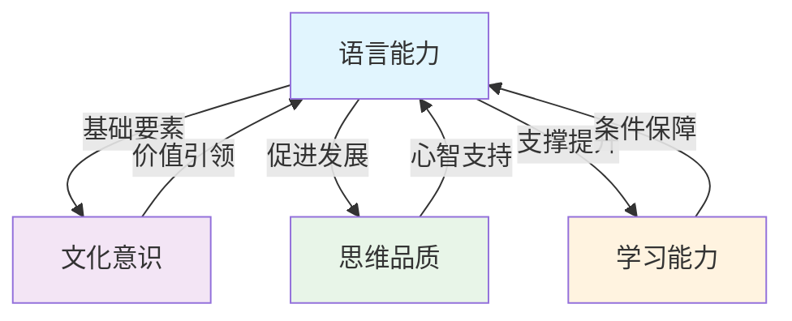

# 🎯 英语学科核心素养体系

> **定义**：学科核心素养是学科育人价值的集中体现，是学生通过学科学习而逐步形成的正确价值观、必备品格和关键能力。

## 📖 核心素养构成

英语学科核心素养主要包括以下四个方面：

### 1. [[语言能力要求]]（基础要素）
**定义**：语言能力指在社会情境中，以听、说、读、看、写等方式理解和表达意义的能力，以及在学习和使用语言的过程中形成的语言意识和语感。

**地位**：英语语言能力构成英语学科核心素养的**基础要素**。

**作用**：英语语言能力的提高蕴含文化意识、思维品质和学习能力的提升，有助于学生拓展国际视野和思维方式，开展跨文化交流。

### 2. [[文化意识目标]]（价值取向）
**定义**：文化意识指对中外文化的理解和对优秀文化的认同，是学生在全球化背景下表现出的跨文化认知、态度和行为取向。

**地位**：文化意识体现英语学科核心素养的**价值取向**。

**作用**：文化意识的培育有助于学生增强国家认同和家国情怀，坚定文化自信，树立人类命运共同体意识，学会做人做事，成长为有文明素养和社会责任感的人。

### 3. [[思维品质要求]]（心智特征）
**定义**：思维品质指思维在逻辑性、批判性、创新性等方面所表现的能力和水平。

**地位**：思维品质体现英语学科核心素养的**心智特征**。

**作用**：思维品质的发展有助于提升学生分析和解决问题的能力，使他们能够从跨文化视角观察和认识世界，对事物作出正确的价值判断。

### 4. [[学习能力培养]]（发展条件）
**定义**：学习能力指学生积极运用和主动调适英语学习策略、拓宽英语学习渠道、努力提升英语学习效率的意识和能力。

**地位**：学习能力构成英语学科核心素养的**发展条件**。

**作用**：学习能力的培养有助于学生做好英语学习的自我管理，养成良好的学习习惯，多渠道获取学习资源，自主、高效地开展学习。

---

## 🔄 四大素养的相互关系

**解读**：
1. **语言能力是基础**：其他三大素养都在语言能力的基础上发展
2. **相互促进关系**：语言能力的提高蕴含其他素养的提升，其他素养也反过来促进语言能力发展
3. **整体育人功能**：四大素养共同构成英语学科完整的育人体系

---

## 🎯 课程目标关联

### 总目标
> 全面贯彻党的教育方针，培育和践行社会主义核心价值观，落实立德树人根本任务，在义务教育的基础上，进一步促进学生英语学科核心素养的发展，培养具有中国情怀、国际视野和跨文化沟通能力的社会主义建设者和接班人。

### 具体目标
基于课程的总目标，普通高中英语课程的具体目标是培养和发展学生在接受高中英语教育后应具备的语言能力、文化意识、思维品质、学习能力等学科核心素养。

### 水平划分
普通高中英语学科核心素养各要素的发展以三个水平划分，水平描述参见“附录 1 英语学科核心素养水平划分”。

通过本课程的学习，学生应能达到本学段英语课程标准所设定的四项学科核心素养的发展目标。

---

## 📊 素养目标细化

### 语言能力目标
具有一定的语言意识和英语语感，在常见的具体语境中整合性地运用已有语言知识，理解口头和书面语篇所表达的意义，识别其恰当表意所采用的手段，有效地使用口语和书面语表达意义和进行人际交流。

### 文化意识目标
获得文化知识，理解文化内涵，比较文化异同，汲取文化精华，形成正确的价值观，坚定文化自信，形成自尊、自信、自强的良好品格，具备一定的跨文化沟通和传播中华文化的能力。

### 思维品质目标
能辨析语言和文化中的具体现象，梳理、概括信息，建构新概念，分析、推断信息的逻辑关系，正确评判各种思想观点，创造性地表达自己的观点，具备多元思维的意识和创新思维的能力。

### 学习能力目标
树立正确的英语学习观，保持对英语学习的兴趣，具有明确的学习目标，能够多渠道获取英语学习资源，有效规划学习时间和学习任务，选择恰当的策略与方法，监控、评价、反思和调整自己的学习内容和进程，逐步提高使用英语学习其他学科知识的意识和能力。

---

## 🔗 教学应用指引

### 备课设计
1. **明确素养目标**：每节课应明确重点培养的1-2项核心素养
2. **设计素养活动**：围绕素养目标设计综合性学习活动
3. **评估素养发展**：设计能够体现素养水平的评价任务

### 教材分析
1. **识别素养载体**：分析教材内容承载的核心素养要素
2. **建立素养关联**：将教材内容与四大素养建立明确联系
3. **补充素养资源**：针对教材不足补充相关素养发展材料

### 考题设计
1. **体现素养导向**：题目应考察学生的核心素养水平
2. **设置素养情境**：在真实情境中考察素养应用能力
3. **分层素养要求**：根据学生水平设置不同层次的素养要求

---

## 📁 关联文件

### 详细解读
- [[语言能力要求]] - 语言能力的详细要求与水平划分
- [[文化意识目标]] - 文化意识的具体目标与内容
- [[思维品质要求]] - 思维品质的发展要求与表现
- [[学习能力培养]] - 学习能力的培养策略与方法

### 相关标准
- [[学业质量水平]] - 核心素养的学业质量表现标准
- [[课程标准总览]] - 返回课程标准总索引

### 应用场景
- [[教材知识库]] - 教材中核心素养的体现与分析
- [[考题应用库]] - 考题中核心素养的考察设计

---

## 📝 处理记录

### 2026-04-13
- ✅ 从原始文件提取核心素养定义
- ✅ 建立四大素养的清晰结构
- ✅ 创建本文件作为核心素养总览
- 🔄 正在创建各素养的详细文件

### 后续工作
1. 提取“附录1 英语学科核心素养水平划分”的详细内容
2. 将水平划分与四大素养详细文件关联
3. 建立素养与教材单元的具体对应关系

---

> **教学提示**：核心素养是英语教学的“魂”，所有教学活动都应围绕发展学生核心素养展开。建议在备课、上课、评价各环节都明确思考“本节课发展了学生的哪些核心素养”。

---
*本文件基于《普通高中英语课程标准（2017年版2020年修订）》“二、学科核心素养与课程目标”部分结构化生成*